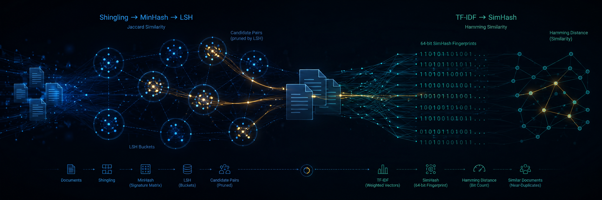

# Semantic Similarity Engine

<p align="center">
      
</p>

An educational, industry-inspired command line system for detecting duplicate, copied, and paraphrased documents. It implements and compares **two independent similarity-detection approaches, built entirely from scratch**:

1. **Shingling + MinHash + LSH** — documents are represented as sets of word $k$-shingles; Jaccard similarity is estimated via MinHash signatures and pruned via Locality-Sensitive Hashing (LSH), so a large corpus never needs exhaustive pairwise comparison.
2. **TF-IDF weighted SimHash** — each document is reduced to a single 64-bit fingerprint; similarity is measured as a Hamming-distance bit-count.

All core algorithms are implemented from scratch using only Python, NumPy, and Pandas.

📄 **Full technical report** (method, parameter selection, datasets, results, error analysis): [`Report`](docs/Report.pdf)

📓 **Interactive walkthrough** of every method and CLI command: [`exploration.ipynb`](notebooks/exploration.ipynb)

📖 **Complete CLI Reference** — every command and flag available in the project's CLI (`plagiarism_engine.cli`) and its companion data-prep script (`scripts/prepare_pan_pc11_pairs.py`): [`CLI_REFERENCE`](CLI_REFERENCE.md)

---

## 📊 Results at a Glance

Validated on three datasets — a hand-curated document corpus, a synthetic labeled question-pair set, and the **real, 22,186-pair PAN-PC-11 plagiarism corpus**:

| Evaluation | Method | Precision | Recall | F1 |
|---|---|---:|---:|---:|
| Synthetic question pairs (60 pairs) | MinHash + LSH | 0.730 | 0.900 | 0.806 |
| Synthetic question pairs (60 pairs) | TF-IDF SimHash | 0.556 | 1.000 | 0.714 |
| Real PAN-PC-11 (4,000 pairs, tuned) | MinHash + LSH | 0.971 | 0.875 | **0.920** |
| Real PAN-PC-11 (4,000 pairs, tuned) | TF-IDF SimHash | 0.839 | 0.745 | 0.789 |

✅ Neither method is categorically better — SimHash wins on short questions, MinHash+LSH wins on long, heavily-obfuscated literary spans once the shingle size and decision threshold are tuned to the corpus. See `docs/Report.pdf`, Sections 5 and 7, for the full tuning story and an important caveat on the PAN-PC-11 numbers.

---

## ⚙️ Installation

**Requires Python 3.11+.**

```bash
python -m venv .venv
```

```bash
# Linux / macOS
source .venv/bin/activate

# Windows (PowerShell / CMD)
.venv\Scripts\activate
```

```bash
pip install -e ".[dev]"
```

This installs the runtime dependencies (`numpy`, `pandas`, `click`), `pytest` for the test suite, and the `plagiarism_engine` package itself in editable mode. A console entry point `plagiarism-engine` is also installed; it is exactly equivalent to `python -m plagiarism_engine.cli`.


---

## 🚀 Quickstart

```bash
# 1. Compare two documents directly
python -m plagiarism_engine.cli compare \
    --file-a data/sample_corpus/doc_01.txt --file-b data/sample_corpus/doc_02.txt

# 2. Search a folder for near-duplicates
python -m plagiarism_engine.cli corpus \
    --data data/sample_corpus --threshold 0.25 --output outputs/candidates.csv

# 3. Evaluate on a labeled pair dataset (bundled synthetic demo file)
python -m plagiarism_engine.cli pairs \
    --pairs data/raw/quora/sample_pairs.csv \
    --text-col-a question1 --text-col-b question2 --label-col is_duplicate \
    --shingle-size 1 --sweep --output outputs/metrics.csv
```

---

## 📚 Using the Real PAN-PC-11 Corpus

The helper script `scripts/prepare_pan_pc11_pairs.py` converts a locally downloaded copy of the PAN-PC-11 corpus (raw documents and XML plagiarism annotations from Zenodo) into a CSV compatible with the `pairs` command, without requiring any changes to `src/plagiarism_engine/`.

For complete usage instructions and example commands, see:

* **CLI Reference:** [`CLI_REFERENCE.md`](CLI_REFERENCE.md)
* **Dataset setup guide:** [`data/raw/README.md`](data/raw/README.md)

The dataset guide includes the complete walkthrough, the expected PAN-PC-11 directory structure, and a documented limitation of the generated evaluation pairs (length mismatch between positive and negative examples).

---

## 🧪 Running the Tests

```bash
pip install -r requirements.txt -e .   # if not already installed
pytest -v
```

The suite in `tests/test_engine.py` (**46 tests**) covers:

- ✅ Preprocessing (including empty-document, short-document, and unusual-character edge cases)
- ✅ MinHash signature correctness and determinism
- ✅ LSH candidate generation
- ✅ SimHash fingerprinting
- ✅ Evaluation metrics (including threshold-sweep utilities)
- ✅ Dataset I/O

---

## 🗂️ Project Structure

```
semantic-plagiarism-engine/
├── README.md
├── pyproject.toml
├── .gitignore
├── docs/
│   ├── Report.tex              # Technical report (LaTeX source)
│   ├── Report.pdf              # Technical report (compiled)
│   └── figures/                # Report figures (generated, reproducible)
├── data/
│   ├── sample_corpus/          # Small demo corpus for `compare` / `corpus`
│   ├── raw/                    # Large third-party datasets go here (not bundled)
│   │   └── quora/sample_pairs.csv   # Small synthetic demo pairs (bundled)
│   └── processed/              # Derived/cached datasets go here
├── src/
│   └── plagiarism_engine/
│       ├── preprocessing.py    # Normalization, tokenization, shingling
│       ├── minhash.py          # From-scratch MinHash
│       ├── lsh.py              # From-scratch banded LSH
│       ├── simhash.py          # From-scratch TF-IDF weighted SimHash
│       ├── dataset.py          # Corpus / pair-CSV loading and saving
│       ├── evaluation.py       # Metrics, threshold sweep, pipeline runners
│       └── cli.py              # `compare` / `corpus` / `pairs` commands
├── scripts/
│   └── prepare_pan_pc11_pairs.py   # Convert a local PAN-PC-11 download into
│                                   # a `pairs`-compatible CSV (optional)
├── notebooks/
│   └── exploration.ipynb       # Full walkthrough: all 3 CLI commands, parameter
│                               # selection, and the real PAN-PC-11 case study
├── tests/
│   └── test_engine.py          # 46 tests
└── outputs/                    # Generated outputs (metrics, candidate pairs, etc.)
```


---

## 🔬 Method Summary

| | 🧩 Shingling + MinHash + LSH | 🔢 TF-IDF weighted SimHash |
|---|---|---|
| **Document representation** | Set of word $k$-shingles | Weighted bag of tokens |
| **Similarity signal** | Jaccard similarity (exact or estimated) | Hamming distance between 64-bit fingerprints |
| **Sensitive to** | Exact wording / word order | Vocabulary overlap (order-independent) |
| **Scales via** | LSH banding (skip most pairwise comparisons) | O(1) fingerprint comparison per pair |
| **Strength** | Robust when edits are concentrated (verbatim / lightly-edited copies) | Robust to reordering; strong on very short text |
| **Weakness** | Struggles when edits are scattered throughout a long passage, unless $k$ is reduced | Still lexical, not truly semantic; sensitive to vocabulary swaps |

📄 For implementation details, parameter tuning, and error analysis, see `docs/Report.pdf`.

---

## 📝 Summary
This project implements a semantic plagiarism and near-duplicate detection engine using two independent approaches: Shingling + MinHash + LSH and TF-IDF weighted SimHash.  
It evaluates the methods on small curated documents, synthetic labeled pairs, and the PAN-PC-11 plagiarism corpus using precision, recall, F1-score, and runtime metrics.  
The report compares the strengths, limitations, and failure cases of both pipelines in detecting exact, near-exact, and paraphrased textual similarity.

